# SQL-TASK EXERCISES
This repository contains a series of SQL exercises designed to test and improve SQL querying skills. Each exercise is presented as an image file, and the corresponding SQL queries or solutions are provided below each exercise description.

## SQL Exercises
For additional SQL exercises and learning resources, you can also visit SQLBolt. SQLBolt offers interactive SQL tutorials and exercises that cover a wide range of topics.

## Screenshots

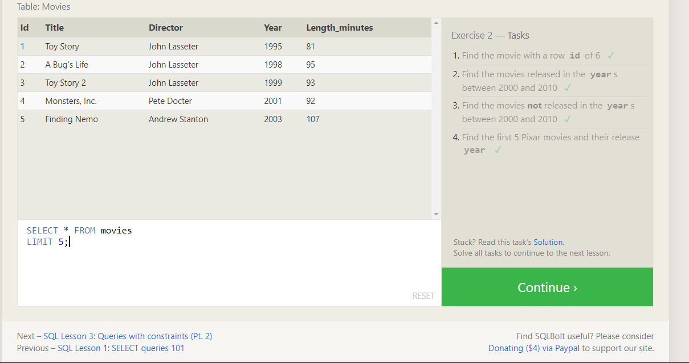
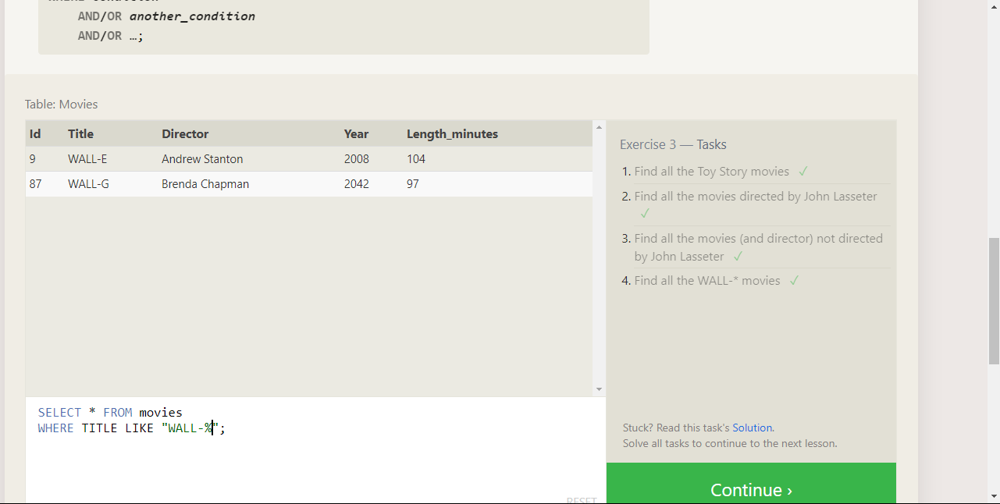
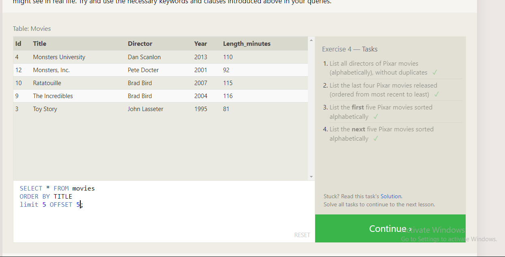
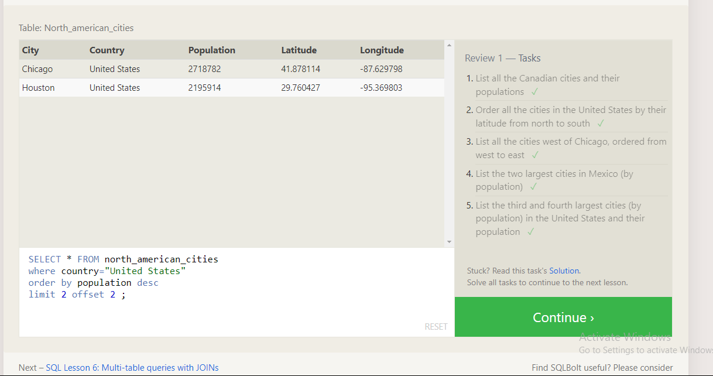
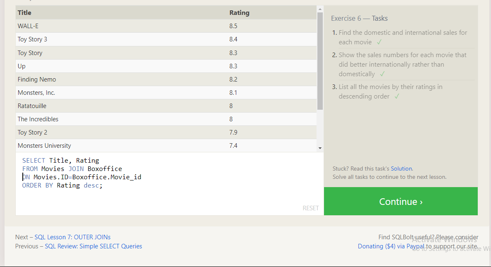
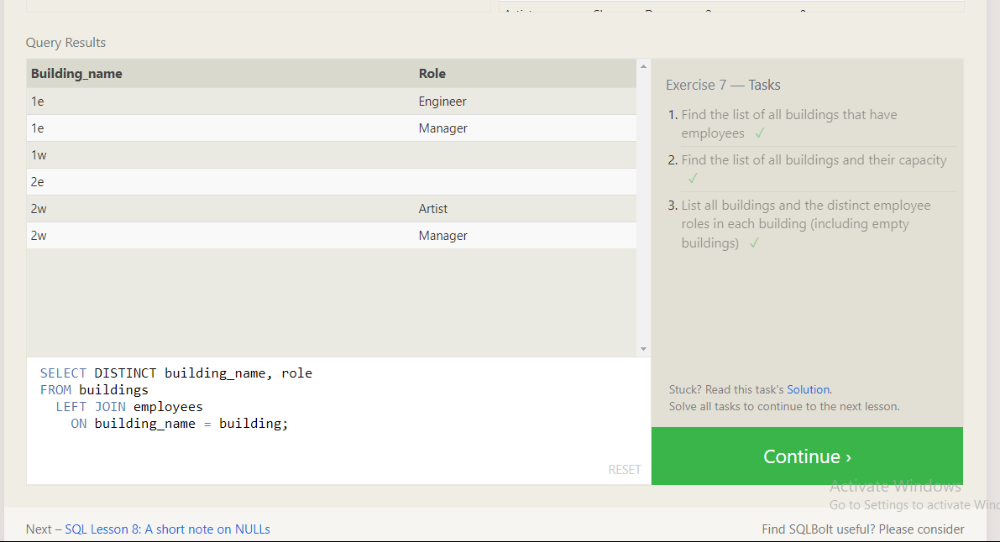
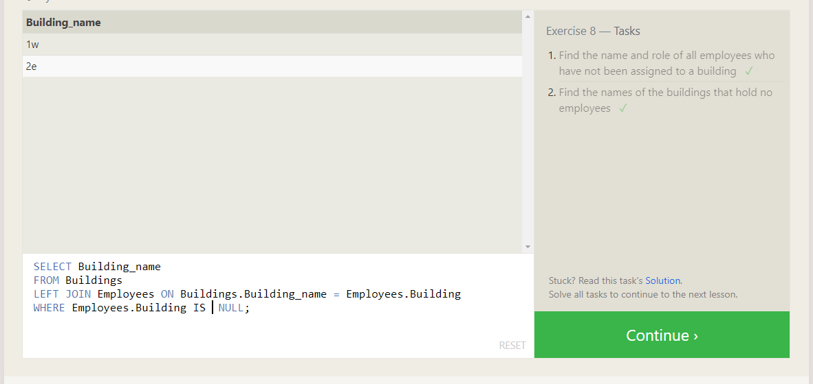
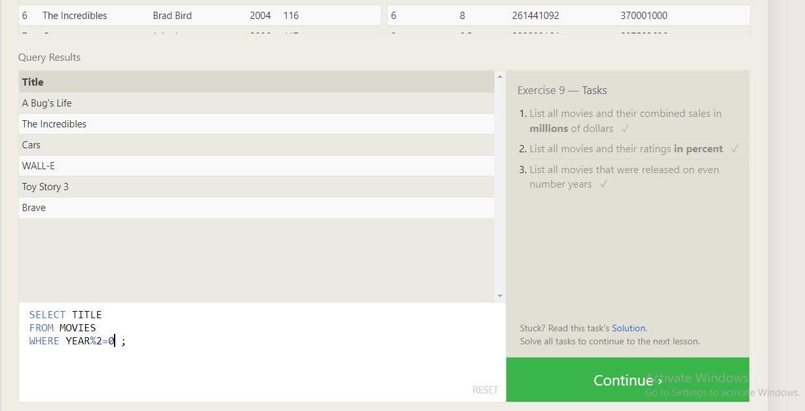
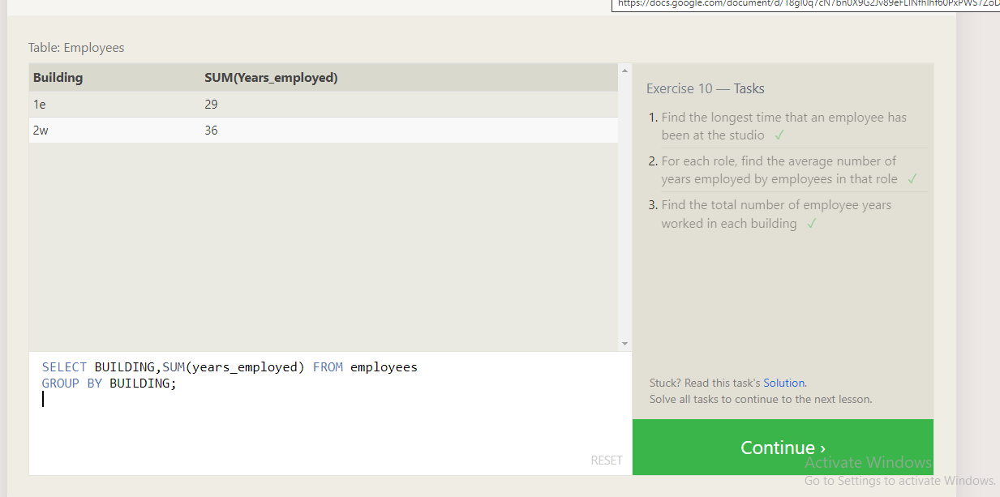
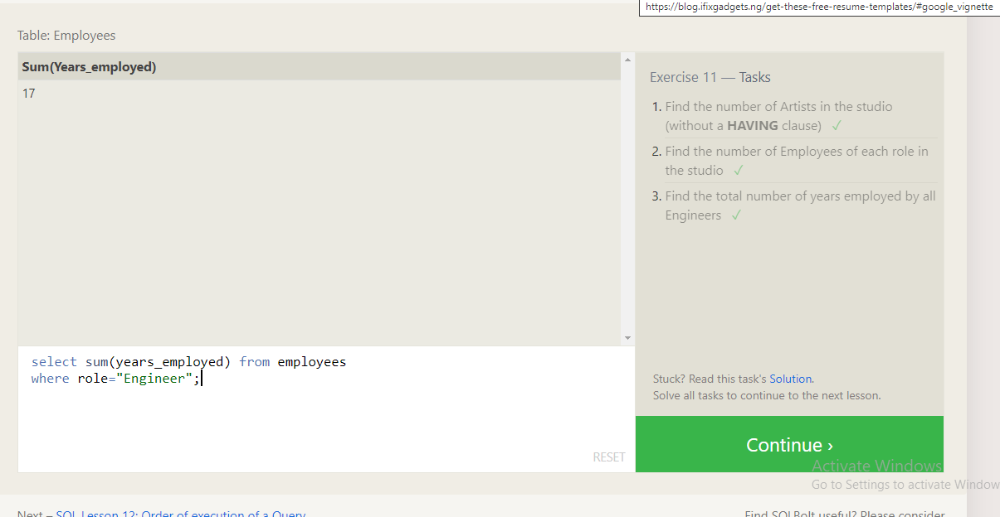
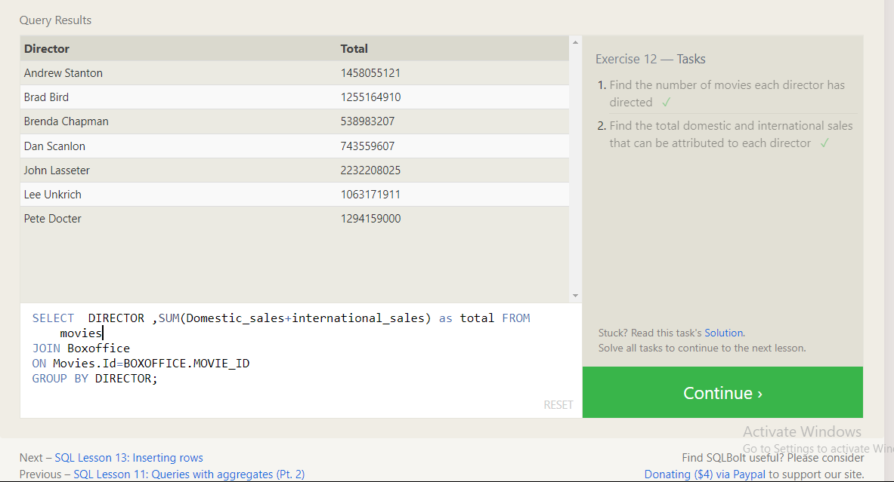
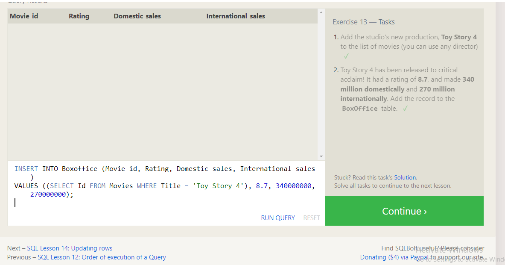
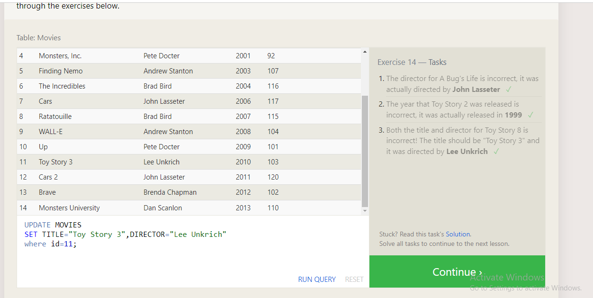
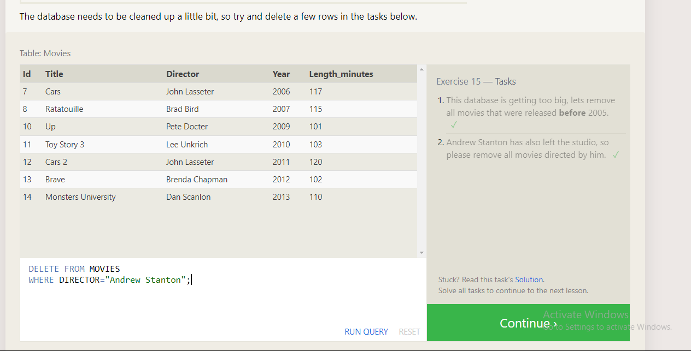
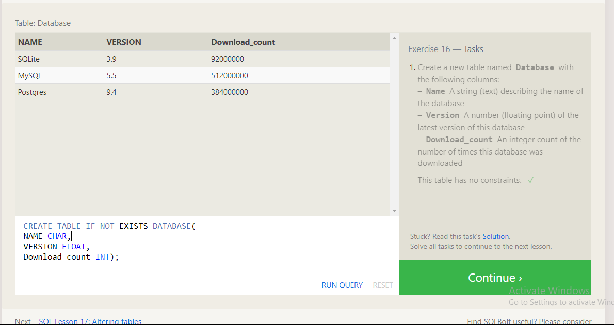
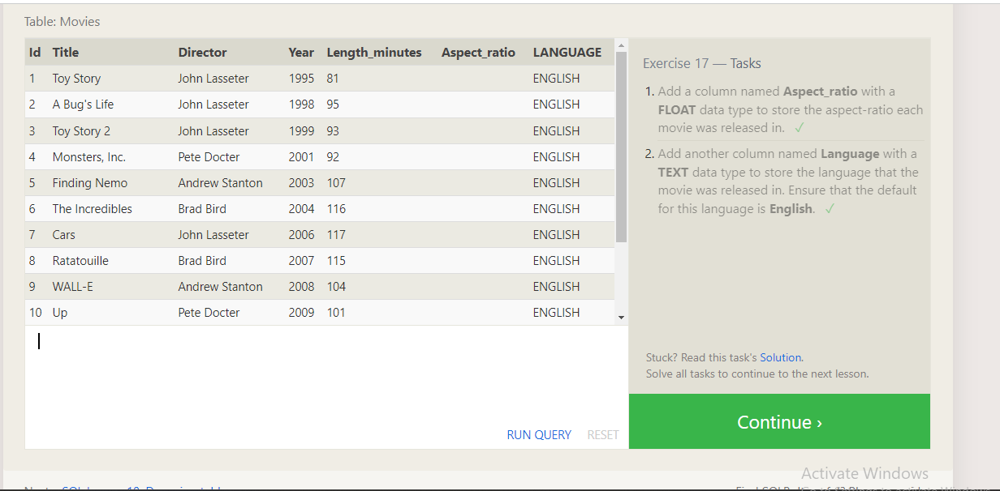
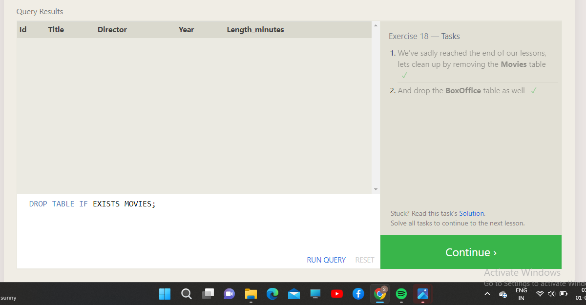
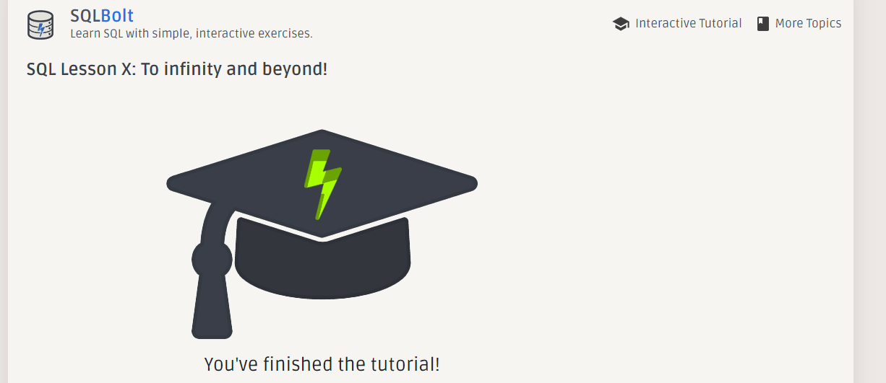

